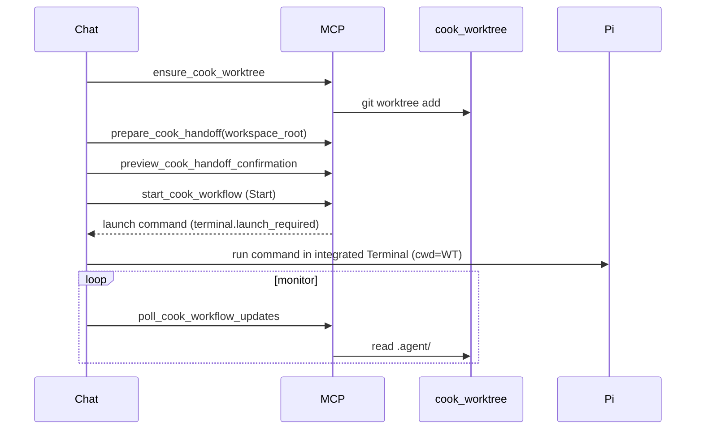

# Cook Handoff MCP

Cursor-side MCP server for the full handoff flow: worktree → prepare → chat confirm → Pi kickoff → monitor.

## Quick start

```bash
cd mcp/cook-handoff && npm install
```

Wire MCP in Cursor using [`cursor/mcp/cook-handoff.json.example`](../cursor/mcp/cook-handoff.json.example).

Set `PI_LETSCOOK_EXTENSION_PATH` to your `@linimin/pi-letscook` install root (directory containing `extensions/completion`).

## End-to-end flow



## workspace_root contract

**Required** on prepare, preview, start, status, and poll tools.

- Must be the **cook worktree** path (recommended: `<repo>/.worktrees/cook-<slug>/`).
- Recorded in `.agent/tmp/cursor-handoff.pending.json`.
- `start_cook_workflow` fails closed if request root ≠ sidecar root.

## Pi integration

On `start_cook_workflow`, MCP returns a launch command embedding:

```bash
PI_COMPLETION_CURSOR_HANDOFF_CONFIRMED=<confirmation_id>
```

Run it in the integrated Terminal when `terminal.launch_required` is true. The sidecar moves to `awaiting_terminal_launch` until Pi consumes the handoff; Pi skips duplicate Start/Cancel UI when the sidecar is confirmed/awaiting launch and fresh.

## Monitoring

- `get_cook_workflow_status` — snapshot from `.agent/current/`
- `poll_cook_workflow_updates` — reads `workflow-events.jsonl` + state
- Use `cursor-handoff-monitor` skill in the same chat after kickoff

## Same-repo mode (advanced)

Skip `ensure_cook_worktree` and pass main repo root as `workspace_root`. Only use for short cooks when you will not edit during the run.

## Package layout

See [`mcp/cook-handoff/README.md`](../mcp/cook-handoff/README.md).
