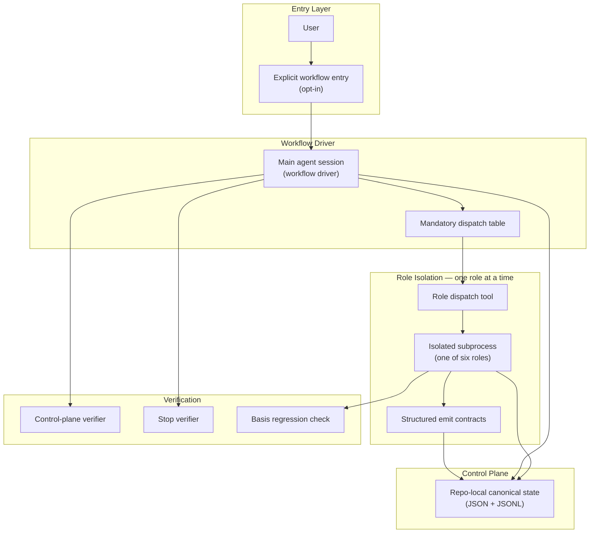
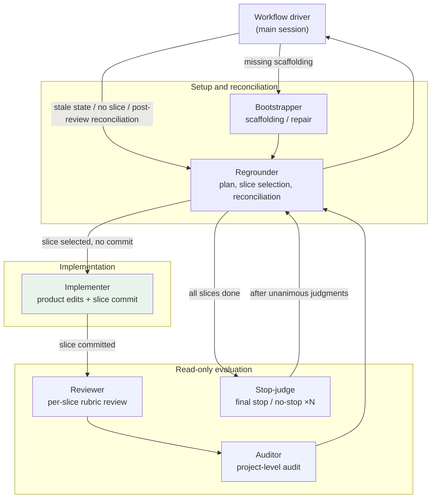
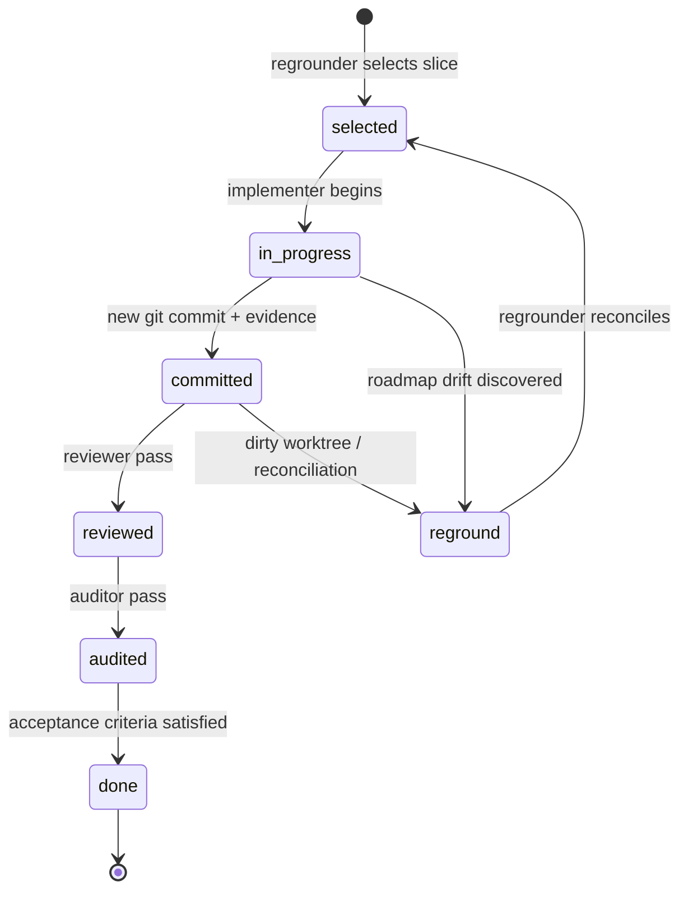

# A Durable Control Plane for Long-Horizon Agentic Coding

Long-horizon repository work—multi-step refactors, follow-up review rounds, tasks that must survive session restarts—exposes a gap in chat-native coding agents. Conversation is a poor control plane: it drifts, cannot be audited mechanically, and offers no principled notion of "done." This document describes a design for treating agentic coding as a **workflow control problem**, with durable out-of-band canonical state, slice-based execution, role-separated authority, and executable verification gates.

---

## Abstract

Coding agents excel at localized edits and Q&A, but struggle when work spans sessions, slices, and review rounds. The failures are not primarily model-capability problems. They are **orchestration and state-management** problems.

The approach reframes long-running agentic coding around six durable ideas:

1. **Durable out-of-band canonical state** that survives compaction and subprocess isolation
2. **Slice-based execution** with acceptance criteria and one-commit discipline
3. **Role separation** enforced by subprocess isolation and tool policy guards
4. **Structured emit contracts** as the boundary between reasoning and durable state
5. **Fail-closed verification** at startup, transcription, evidence, and closure
6. **Explicit opt-in** preserving direct chat for everything else

---

## 1. The Problem

### 1.1 What breaks in long-horizon agent work

When a human developer undertakes a substantial change—fixing a regression across modules, refactoring an API surface, or landing a feature with tests and docs—they rely on structures that chat-native agents lack:

| Human practice | Chat-native agent failure mode |
|----------------|-------------------------------|
| A written plan with verifiable milestones | Scope drifts; "done" is asserted without evidence |
| One change set per logical unit | Multiple concerns land in a single undifferentiated edit burst |
| Code review before merge | The same agent that wrote the code judges its own correctness |
| CI / test gates | Verification is optional, summarized, or hallucinated |
| Resuming after interruption | Context compaction loses mission alignment |
| Knowing who may edit what | Authority blurs: planner, implementer, and reviewer collapse into one session |

A capable model with unbounded edit authority and no canonical workflow state will still produce work that is hard to resume, hard to audit, and easy to prematurely declare complete.

### 1.2 The design question

*What minimal control-plane structure lets a local coding agent behave more like a disciplined engineering workflow—without requiring a cloud orchestrator, without forbidding direct edits in ordinary chat, and without trusting free-form prose as the source of truth?*

The answer is a **local, git-adjacent control plane**: repo-local canonical state, explicit roles with bounded authority, slice contracts, and verification scripts whose behavior is part of the protocol contract—not optional documentation.

---

## 2. Design Principles

### 2.1 Durable out-of-band canonical state

Workflow state must live **outside the conversation buffer**. Chat is ephemeral; compaction, session restarts, and subprocess isolation will discard or distort it. The control plane therefore needs durable state that roles can re-read authoritatively after any interruption.

The required invariants are:

| Invariant | Meaning |
|-----------|---------|
| **Out-of-band** | State is not conversation memory; it survives context compaction |
| **Durable** | State persists across sessions and subprocess boundaries |
| **Machine-readable** | Dispatch tables, verifiers, and transcribers can read it mechanically |
| **Authoritative** | Canonical state overrides stale chat summaries |
| **Repo-adjacent** | State is co-located with the git worktree it governs |

Current repository truth and this canonical state together beat conversation memory. After compaction or session restart, every role recovers from durable records—not from summaries embedded in chat.

> Current repo truth beats stale notes, stale summaries, and conversation memory.

### 2.2 Filesystem as the concrete instantiation

The invariants above do not uniquely require a filesystem. SQLite, embedded databases, or git-adjacent artifacts such as notes or tracked metadata could satisfy some of them. For a local coding-agent workflow, a **repo-local filesystem control plane** is the pragmatic choice.

A gitignored `.agent/` directory with JSON and JSONL files offers:

- **Git adjacency** — state lives beside the worktree it governs, without a separate server
- **Inspectability** — humans and scripts can read, diff, and debug state directly
- **Verifier simplicity** — shell and Node entrypoints can validate files by path, without a query layer
- **No extra infrastructure** — no database process, cloud bucket, or sync service
- **Append-only logs** — JSONL transcripts suit audit trails and fail-closed transcription

Alternatives trade these properties away. A remote store adds dependency and weakens local-first operation. SQLite improves query ergonomics but reduces transparency and complicates verifier paths. Filesystem state is not the only valid design—but for repo-scoped, local-first, inspectable agent workflows, it is a strong default instantiation of durable out-of-band state.

### 2.3 Fail closed rather than guess

When startup intent is vague, planning-only, or not a repo change, the workflow refuses to scaffold state. When a role report is malformed or semantically contradictory, transcription rejects it. When verification evidence is missing or stale, verifiers fail. The system prefers blocking over silent degradation.

### 2.4 Authority separation by role, enforced in code

Rather than prompting a single agent to "act as reviewer," the workflow runs **isolated subprocesses** per role, with runtime tool guards that block actions exceeding each role's authority. The implementer may edit product code and commit; the driver may not. Reviewers, auditors, and stop-judges are read-only.

Honor-system prompting is insufficient. Authority must be enforceable when the model disagrees.

### 2.5 One slice at a time, one commit per slice

Work decomposes into **slices**: bounded units with non-empty acceptance criteria, declared implementation surfaces, verification commands, and a locked basis commit. A slice is not complete until it lands as a new commit with structured evidence recorded in canonical state.

### 2.6 Executable specification

Protocol behavior is not only documented—it is **tested as contract**. Regression suites cover control-plane schema parity, evaluator calibration, dirty-worktree policy, stop-wave semantics, and authority boundaries. A release that diverges from the documented protocol fails closed.

Documentation, agent prompts, skills, and verifiers form a closed loop: if they diverge, the gate fails.

---

## 3. Architecture

The topology is **flat and primary-driven**: one main agent session acts as the workflow root and dispatches at most one specialized role at a time. Roles cannot nest-dispatch other roles. There is no application server, database, or cloud dependency—everything is local and repo-scoped.



### 3.1 The six roles

Six roles cover setup, execution, evaluation, and closure. Only one runs per dispatch; the diagram below shows their typical routing.



| Role | Authority |
|------|-----------|
| **Bootstrapper** | First-time control-plane scaffolding and repair |
| **Regrounder** | Canonical reconciliation, slice selection, dirty-worktree handling, stop-wave reconciliation |
| **Implementer** | **Only** role that edits product code and creates slice commits |
| **Reviewer** | Read-only per-slice review with structured rubric |
| **Auditor** | Read-only project-level audit |
| **Stop-judge** | Independent read-only final stop/no-stop judgment |

The regrounder appears at multiple dispatch points—not only at workflow start—because it also handles dirty-worktree reconciliation, roadmap drift, and final stop reconciliation.

### 3.2 Structured subprocess I/O

Roles do not return authority-bearing freeform markdown. They terminate through versioned **structured emit contracts** with stable schema IDs. The orchestrator validates, renders, and transcribes payloads into canonical append-only records.

This schema-driven boundary is the integration surface between LLM reasoning and durable workflow state. Free-form prose may explain; it does not authorize transitions.

### 3.3 Internal helpers (non-authoritative)

Optional read-only helpers (e.g. scout, critic) may run beneath allowed roles during implementation or reconciliation. Helper output is structured JSON that informs the calling role; it does not directly mutate canonical state or product files.

---

## 4. The Canonical Control Plane

The durable out-of-band layer is instantiated as a gitignored, repo-local filesystem directory—conceptually a control plane adjacent to the repository, not inside chat history:

```text
.agent/
  current/
    state.json                  # Workflow controller
    startup-brief.json          # Confirmed workflow intake
    plan.json                   # Slice backlog with acceptance criteria
    active-slice.json           # Implementation contract for current slice
    slice-history.jsonl         # Append-only role transcripts
    stop-check-history.jsonl    # Stop-judge judgments
    verification-evidence.json  # Structured command results and coverage
    tmp/                        # Repo-local scratch space
  verify_completion_stop.sh
  verify_completion_control_plane.sh
```

### 4.1 Workflow controller (`state.json`)

The controller drives automation through fields such as:

- `current_phase` — lifecycle position
- `continuation_policy` — `continue`, `await_user_input`, `blocked`, `paused`, or `done`
- `next_mandatory_role` — which role the driver must dispatch next
- `requires_reground` — whether canonical reconciliation is needed
- `remaining_stop_judges` — how many unanimous stop judgments remain
- `current_stop_wave_id` — epoch for re-evaluating stop on the same HEAD without synthetic commits

When `continuation_policy == continue`, the workflow is **sticky**: the driver auto-dispatches mandatory roles until state transitions to a stopping posture. It does not ask "shall I continue?" between slices.

### 4.2 Startup brief vs. slice plan

A deliberate separation prevents confusion:

- **Startup brief** captures confirmed workflow intake: what the user wants, advisory hints, optional verifier-posture fields. It is intake, *not* the slice plan.
- **Plan** is authored by the regrounder from **repo truth** after confirmation. Startup hints are advisory; the regrounder owns slice boundaries and acceptance criteria.

Prose-level mission statements must not silently become unreviewed execution contracts.

### 4.3 Active-slice contract

The active-slice file is the canonical implementation contract for the current slice. Beyond goal and acceptance criteria, it requires:

- `implementation_surfaces` — expected repo touchpoints
- `verification_commands` — deterministic checks before commit
- `basis_commit` — clean HEAD at slice selection
- `locked_notes` / `must_fix_findings` — scope locks and review follow-ups
- Before-slice counters that must be preserved across handoffs

Control-plane verifiers fail closed when plan, active-slice, and selected slice drift—a guard against prose-only recovery after compaction.

---

## 5. The Slice Lifecycle

The slice is the central unit of work. Each plan entry must have non-empty `acceptance_criteria`: concrete, verifiable conditions that define done. Criteria are immutable after lock except for evidence-driven adjustments.



**Mandatory dispatch table:**

1. Missing scaffolding → bootstrapper
2. Stale or ambiguous state → regrounder
3. No slice selected → regrounder
4. Slice selected/in-progress, no commit → implementer
5. Committed slice, no review → reviewer
6. No audit → auditor
7. Post-review/audit reconciliation → regrounder
8. All slices done → stop-judge (×N)
9. After stop judgments → run stop verifier + final regrounder reconciliation

The workflow driver must not substitute itself for any mandatory target. While a slice is active, the driver cannot directly edit product files or create the slice commit.

### 5.1 Clean worktree discipline

Before advancing to the next slice after a commit, the tracked worktree must be clean. Dirty state blocks progression and triggers reconciliation. When unrelated tracked changes can be isolated safely, the workflow auto-preserves them via a reversible mechanism (e.g. named git stash plus a control-plane note), continues on a clean tree, and restores before returning control—escalating to the user only on overlap or conflict.

### 5.2 Basis regression for bugfixes

For eligible regression slices, verification reruns at the locked `basis_commit` in a disposable worktree. This provides evidentiary proof that the bug existed on the basis—a workflow-layer analogue of "write a failing test first."

---

## 6. Evaluation, Verification, and Closure

### 6.1 Shared evaluation rubric

Read-only evaluation roles share a structured rubric with four dimensions:

1. Contract coverage
2. Correctness risk
3. Verification evidence
4. Docs/state parity

Each dimension receives `pass`, `concern`, or `fail`. A `fail` forces a negative final verdict; well-formed but semantically lenient reports are also rejected through calibration tests.

### 6.2 Verification evidence artifact

Verification evidence is a durable, structured artifact—not a prose summary. It carries command results, acceptance coverage, basis-regression status, flake signals, and open gaps. Recovery surfaces thread concise summaries from this file so evaluators can resume after compaction without depending on chat history.

### 6.3 Stop waves and unanimous closure

Default stop policy requires multiple independent stop-judge subprocesses to agree that work may stop (e.g. two judges, unanimous on current HEAD). Stop-wave epochs allow restarting stop evaluation on the same HEAD when reconciliation changes canonical truth without requiring a synthetic commit.

Final closure runs a stop verifier and regrounder reconciliation before `continuation_policy` may become `done`. On closure, control-plane cleanup may remove the entire `.agent/` directory—expected behavior, not an anomaly.

---

## 7. Workflow Mode vs. Ordinary Chat

The design deliberately preserves **two modes**:

| Mode | When to use | Behavior |
|------|-------------|----------|
| **Ordinary chat** | Quick edits, Q&A, brainstorming, multi-file work without workflow overhead | Direct repo edits allowed; no role dispatch; no workflow protocol loaded |
| **Workflow mode** | Resumable missions, review/audit rounds, canonical state, confirm-first boundaries | Explicit entry; fail-closed startup synthesis; role dispatch; sticky continuation |

Workflow mode is optional—not mandatory for substantial tasks. The primary agent should not proactively force workflow entry.

### 7.1 Fail-closed startup

Workflow entry triggers handoff synthesis from current context. The user confirms **Start** or **Cancel** only after a startable brief is produced. If synthesis cannot produce a startable handoff—vague intent, planning-only input, non-repo-change—the workflow does not rewrite canonical state.

Routing fields such as task type and evaluation profile are not inferred from free text; explicit structured artifacts or packaged defaults apply.

### 7.2 Lifecycle controls

- **Start / resume** — enter or continue from saved state
- **Park** — pause for ordinary direct edits (forces reground on resume)
- **Cancel** — close a stopped or parked workflow

---

## 8. Policy Guards and Enforcement

Runtime tool guards enforce authority:

- Nested role dispatch is forbidden from within a role
- Role dispatch is available only in active workflow sessions
- Reviewer, auditor, and stop-judge cannot use mutating edit/write tools or mutating shell commands
- Bootstrapper and regrounder may edit only control-plane files (and `.gitignore`)
- The workflow driver cannot commit or edit product files while hard-locked
- Internal helpers are gated to implementer and regrounder during active workflow

This answers a question agent frameworks often leave implicit: **who is allowed to change what, and how is that enforced when the model disagrees?**

---

## 9. Trade-offs and Positioning

### 9.1 What this approach is not

- **Not a cloud workflow orchestrator.** Everything is local, repo-scoped, and package-owned.
- **Not a replacement for ordinary chat.** Direct implementation remains valid when workflow overhead is unnecessary.
- **Not a guarantee of correctness.** Roles and verifiers reduce risk and drift; they do not prove formal correctness.
- **Not host-agnostic by default.** A concrete implementation binds to a specific coding-agent runtime, subprocess isolation, and tool ecosystem.

### 9.2 Costs and when to pay them

Workflow mode adds latency (multiple subprocess rounds per slice), token overhead (structured handoffs, rubric reports), and cognitive overhead (slice planning, acceptance criteria). The payoff appears when:

- Work spans multiple sessions or survives compaction
- Review and audit trails matter
- False completion is costly
- Mission drift has already been observed in chat-only attempts

### 9.3 Comparison to adjacent approaches

| Approach | Strength | Gap this design addresses |
|----------|----------|---------------------------|
| Single-agent "keep going" | Low overhead | No resumable control plane; authority blur; weak closure |
| Human-in-the-loop PR workflow | Strong review culture | Not agent-native; no automatic dispatch or recovery |
| Cloud agent platforms with task queues | Scalable orchestration | External dependency; less git-native |
| Prompt-only multi-agent patterns | Flexible role play | Roles collapse without tool enforcement and canonical state |

---

## 10. Executable Specification

A distinguishing characteristic of this design is that **the release gate is part of the protocol**, not ancillary CI hygiene. Regression suites cover:

- Control-plane schema and active-slice contract drift
- Evaluator calibration (rejecting contradictory but well-formed reports)
- Stop-wave epoch semantics
- Dirty-worktree auto-preservation policy
- Worktree-root boundaries (nested worktrees must not inherit ancestor control-plane state)
- Helper authority and structured subprocess output
- Public documentation parity with runtime behavior

This mirrors how safety-critical and protocol-heavy systems are often maintained—except here the specification is a local agent workflow rather than a network protocol.

---

## 11. Conclusion

Long-horizon agentic coding is a **control problem**. Chat history is the wrong abstraction for mission continuity, authority boundaries, and verifiable completion. Durable out-of-band canonical state—with slices, separated roles, structured handoffs, fail-closed gates, and explicit opt-in—offers a minimal structure that behaves more like disciplined software engineering without surrendering the speed of direct agent assistance for everything else.

In this repository, that layer is realized as a repo-local filesystem control plane under `.agent/`. The ideas above are instantiated as a local coding-agent extension with an explicit workflow entry command, six completion roles, and a regression suite that treats protocol behavior as ship-blocking contract. For installation and usage, see [README.md](../../README.md). For maintainer-facing protocol details, see [docs/maintainer/protocol.md](../maintainer/protocol.md).
