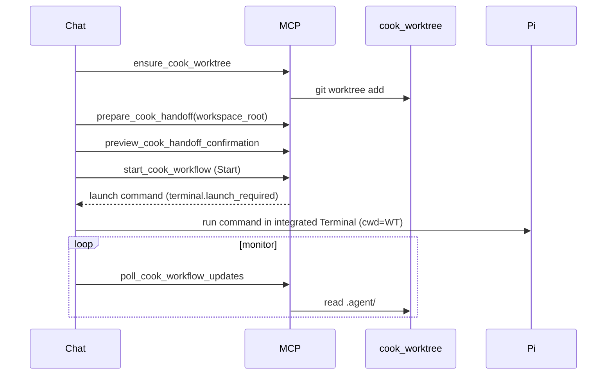

# Cursor IDE Integration

Pi `/cook` cannot read Cursor IDE chat history. Hand off planning work with the **cook-handoff MCP**, a dedicated **git worktree**, or legacy file/inline paths.

## Overview

### Recommended flow (MCP + worktree)

1. Plan in Cursor on your **main checkout**.
2. Use the **cook-handoff MCP** (see [MCP Server](#mcp-server) below):
   - `ensure_cook_worktree` → `.worktrees/cook-<slug>/`
   - `prepare_cook_handoff` → handoff file + pending sidecar
   - `preview_cook_handoff_confirmation` → startup brief in chat
   - User **Start** → `start_cook_workflow` returns a launch command; run it in the integrated Terminal (worktree cwd)
3. Monitor in the same chat via `poll_cook_workflow_updates` (see `cursor-handoff-monitor` skill).

```text
main checkout/                 .worktrees/cook-feature/
Cursor plans & edits      →    Pi /cook + .agent/current/
```

### Division of labor

| Surface | Role |
|---------|------|
| Cursor chat | Plan, confirm handoff, monitor progress |
| Cook worktree | Pi `/cook` execution + `.agent/current/**` |
| Main checkout | Ordinary edits while cook runs on worktree |
| Cursor SDK/CLI (optional) | Implementer and evaluator execution |

### What handoff does not do

- Does not auto-start without explicit Start (chat or Pi UI).
- Does not sync live Cursor chat into Pi after kickoff.
- Does not replace regrounder — file hints are advisory.

---

## Handoff

### Install Cursor assets

```bash
mkdir -p .cursor/skills .cursor/commands .cursor/mcp
cp -r node_modules/@linimin/pi-letscook/cursor/skills/cursor-handoff .cursor/skills/
cp -r node_modules/@linimin/pi-letscook/cursor/skills/cursor-handoff-monitor .cursor/skills/
cp node_modules/@linimin/pi-letscook/cursor/commands/prepare-cook-handoff.md .cursor/commands/
cp node_modules/@linimin/pi-letscook/cursor/mcp/cook-handoff.json.example .cursor/mcp/cook-handoff.json
```

Adjust MCP config paths for your install.

### Legacy / fallback paths

**Plain `/cook` auto-detect** — If `.agent/tmp/cursor-handoff.json` exists and is fresh, plain `/cook` picks it up only while the MCP sidecar is still `pending_review` (or for legacy file-only handoffs with a fresh `captured_at`). After MCP **Start**, `/cook` and `/cook <prompt>` fail closed with a message to run the terminal command.

```bash
pi
/cook
```

**Explicit import:**

```text
/cook import
/cook import path/to/handoff.json
```

**Inline prompt:**

```text
/cook <one-line mission>
```

### After workflow starts

- `/cook resume` — continue from `.agent/` state (in the **worktree** when using worktree flow)
- `/cook park` — pause for edits, then `/cook resume`
- `/cook cancel` — close the workflow

---

## MCP Server

Cursor-side MCP server for the full handoff flow: worktree → prepare → chat confirm → Pi kickoff → monitor.

### Quick start

```bash
cd mcp/cook-handoff && npm install
```

Wire MCP in Cursor using [`cursor/mcp/cook-handoff.json.example`](../../cursor/mcp/cook-handoff.json.example).

Set `PI_LETSCOOK_EXTENSION_PATH` to your `@linimin/pi-letscook` install root (directory containing `extensions/completion`).

### Tools

| Tool | Purpose |
|------|---------|
| `ensure_cook_worktree` | Create `.worktrees/cook-<slug>/` |
| `prepare_cook_handoff` | Validate + write handoff + sidecar |
| `preview_cook_handoff_confirmation` | Startup brief layout for chat confirm |
| `start_cook_workflow` | Confirm + return Pi `/cook` launch command |
| `validate_cook_handoff` | Schema/startability check |
| `get_cook_handoff_status` | Pending/confirmed/stale status |
| `get_cook_handoff_schema` | Example capsule |
| `get_cook_workflow_status` | `.agent/current` snapshot |
| `poll_cook_workflow_updates` | Event deltas for monitoring |

### End-to-end flow



### workspace_root contract

**Required** on prepare, preview, start, status, and poll tools.

- Must be the **cook worktree** path (recommended: `<repo>/.worktrees/cook-<slug>/`).
- Recorded in `.agent/tmp/cursor-handoff.pending.json`.
- `start_cook_workflow` fails closed if request root ≠ sidecar root.

### Pi integration

On `start_cook_workflow`, MCP returns a launch command embedding:

```bash
PI_COMPLETION_CURSOR_HANDOFF_CONFIRMED=<confirmation_id>
```

Run it in the integrated Terminal when `terminal.launch_required` is true. Pi skips duplicate Start/Cancel UI when the sidecar is confirmed/awaiting launch and fresh.

### Monitoring

- `get_cook_workflow_status` — snapshot from `.agent/current/`
- `poll_cook_workflow_updates` — reads `workflow-events.jsonl` + state
- Use `cursor-handoff-monitor` skill in the same chat after kickoff

### Same-repo mode (advanced)

Skip `ensure_cook_worktree` and pass main repo root as `workspace_root`. Only use for short cooks when you will not edit during the run.

### Environment

| Variable | Purpose |
|----------|---------|
| `PI_LETSCOOK_EXTENSION_PATH` | Path passed to `pi -e` (default: package root) |
| `PI_BINARY` | Pi executable (default: `pi`) |
| `WORKSPACE_ROOT` | Fallback workspace root when tool omits it |

---

## Role Backends

Pi remains the workflow driver and control plane. Optional Cursor backends run token-heavy completion roles under your Cursor subscription.

### Prerequisites

- Pi with a provider API key for the driver and control-plane roles
- `CURSOR_API_KEY` (or `PI_COMPLETION_CURSOR_API_KEY`) when Cursor backends are enabled
- Cursor CLI `agent` on `PATH` for evaluator roles (`--mode=ask`)
- Optional: `@cursor/sdk` installed for SDK implementer runs

### Enable

```bash
export PI_COMPLETION_CURSOR_ENABLED=1
export CURSOR_API_KEY="cursor_..."
```

### Default role mapping

| Role | Backend |
|------|---------|
| `completion-implementer` | Cursor SDK (`Agent.prompt` local) |
| `completion-reviewer` | Cursor CLI ask mode |
| `completion-auditor` | Cursor CLI ask mode |
| `completion-stop-judge` | Cursor CLI ask mode |
| `completion-regrounder` | Pi subprocess |
| `completion-bootstrapper` | Pi subprocess |
| scout / critic helpers | Pi subprocess |

### Configuration

| Variable | Purpose |
|----------|---------|
| `PI_COMPLETION_CURSOR_ENABLED` | Master switch (`1` / `true`) |
| `PI_COMPLETION_CURSOR_API_KEY` | Override Cursor API key |
| `PI_COMPLETION_CURSOR_CLI` | CLI binary (default: `agent`) |
| `PI_COMPLETION_CURSOR_MODEL` | Default model id (default: `composer-2.5`) |
| `PI_COMPLETION_CURSOR_MODEL_<ROLE>` | Per-role model override |
| `PI_COMPLETION_CURSOR_SDK_ROLES` | Comma-separated SDK roles |
| `PI_COMPLETION_CURSOR_CLI_ASK_ROLES` | Comma-separated CLI ask roles |

Per-role agent frontmatter in `agents/completion-*.md` (only honored when `PI_COMPLETION_CURSOR_ENABLED` is set):

```yaml
cursor_model: composer-2.5
role_backend: cursor-sdk   # or cursor-cli-ask | pi
```

### Behavior notes

- With `PI_COMPLETION_CURSOR_ENABLED` unset, behavior is unchanged (Pi subprocesses only).
- Pi subprocess roles still fail closed when structured `completion_emit_*` output is missing or invalid.
- Cursor eval roles use text report parsing when structured emit tools are unavailable.
- Configured Cursor roles fail closed if the CLI/SDK or API key is missing; they do not silently fall back to Pi.
- Cursor CLI ask runs use `--trust` for headless evaluator roles. Only enable in repos you trust.
- Cursor SDK implementer runs use `Agent.create` + `run.cancel()` so workflow abort can stop in-flight SDK work.

### Troubleshooting

- **SDK not found:** `npm install @cursor/sdk` in the environment running Pi.
- **CLI not found:** install Cursor CLI and ensure `agent` is on `PATH`, or set `PI_COMPLETION_CURSOR_CLI`.
- **Transcription repair loops:** check role report format against `agents/completion-*.md` fixed fields.

### Live verification (optional)

```bash
export CURSOR_LIVE_TEST=1
export CURSOR_API_KEY="cursor_..."
npm run cursor-cli-live-test
npm run cursor-sdk-live-test
```

Skipped by default in `release-check`. For environments without `pi` on PATH, run `npm run cursor-release-check` instead.

After `/cook import`, the handoff file is consumed only after kickoff is queued. On cleanup failure, Pi quarantines the file under `.agent/tmp/cursor-handoff.quarantined.*.json`.
