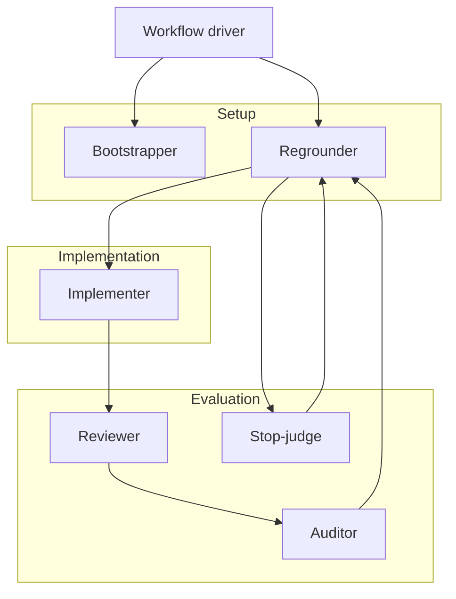
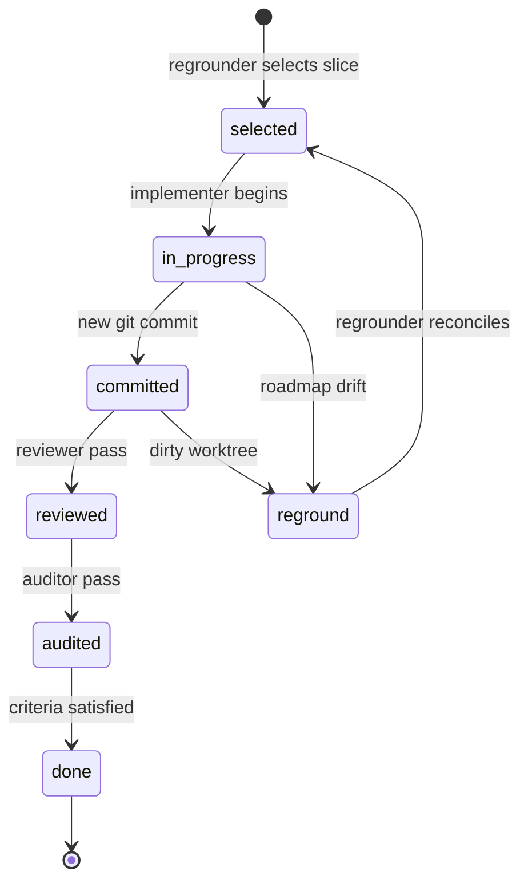

# User Guide

## Getting Started

### Install

```bash
pi install npm:@linimin/pi-letscook
```

Then run `/reload` in Pi.

### First `/cook` workflow

1. Describe the repo change you want Pi to complete.
2. Run `/cook` or `/cook <prompt>`.
3. Pi prepares a startup brief.
4. Choose **Start** to begin, or **Cancel** to return to ordinary chat.
5. Later, run `/cook` or `/cook resume` to continue from saved workflow state.

Example:

```text
/cook add login redirect handling and the missing redirect tests
```

### Ordinary chat vs workflow mode

| Mode | When to use |
|------|-------------|
| **Ordinary chat** | Quick edits, Q&A, brainstorming, planning-only work |
| **`/cook` workflow** | Multi-session missions, review/audit rounds, resumable state |

Use `/cook` when you want Pi to:

- keep the same coding mission alive across sessions
- split a repo change into reviewable slices
- resume, refocus, park, or cancel work explicitly
- run review/audit/verification before marking the task done
- fail closed instead of starting from vague or planning-only input

`/cook` is optional. Ordinary chat still works normally and can edit the repo directly.

For Cursor IDE integration, see [integrations/cursor.md](integrations/cursor.md).

---

## Commands

| Command | Purpose |
|---------|---------|
| `/cook` | Start or resume a workflow |
| `/cook <prompt>` | Start with inline task intent |
| `/cook resume` | Resume from saved `.agent/` state |
| `/cook park` | Pause an active workflow for ordinary direct edits |
| `/cook cancel` | Close a stopped or parked workflow |
| `/cook import` | Import an explicit handoff file (see [Cursor integration](integrations/cursor.md)) |

### Lifecycle controls

**Park** — Available anytime an active workflow exists, including while work is still progressing. Records a paused posture so you can edit the repo normally. Resume routes through canonical reconciliation (`requires_reground = true`).

**Resume** — Continue from canonical `.agent/` state. Use `/cook` or `/cook resume` when the workflow is stopped, blocked, awaiting input, or parked.

**Cancel** — Closes the workflow and clears stale hard locks. When a workflow reaches `done` or `cancelled`, extension cleanup may remove the entire `.agent/` directory.

**Fail-closed startup** — `/cook` synthesizes a startup brief from current context and asks **Start** or **Cancel** before writing canonical state. If synthesis cannot produce a startable brief (vague intent, planning-only input), `/cook` fails closed and leaves `.agent/` unchanged.

---

## Workflow Concepts

### Six roles

One specialized role runs at a time. The main Pi session acts as the workflow driver and dispatches roles automatically.

| Role | What it does |
|------|--------------|
| **Bootstrapper** | First-time `.agent/` scaffolding and repair |
| **Regrounder** | Reconciles plan, selects slices, handles dirty worktree |
| **Implementer** | **Only** role that edits product code and creates slice commits |
| **Reviewer** | Read-only per-slice review |
| **Auditor** | Read-only project-level audit |
| **Stop-judge** | Independent final stop/no-stop judgment |



### Slice lifecycle

Work decomposes into **slices**: bounded units with acceptance criteria, verification commands, and one commit each.



While `continuation_policy` is `continue`, the driver auto-dispatches mandatory roles until the workflow stops, blocks, pauses, or completes.

### Canonical state (`.agent/current/`)

Workflow state lives in a gitignored `.agent/` directory local to the repo:

| File | Purpose |
|------|---------|
| `state.json` | Workflow controller — phase, continuation policy, next role |
| `startup-brief.json` | Confirmed workflow intake (not the slice plan) |
| `plan.json` | Slice backlog with acceptance criteria |
| `active-slice.json` | Implementation contract for the current slice |
| `slice-history.jsonl` | Append-only role transcripts |
| `stop-check-history.jsonl` | Stop-judge judgments |
| `verification-evidence.json` | Structured test/command results |

Current repo truth plus canonical `.agent/` state beat conversation memory. After compaction or session restart, roles recover from these files.

### Evaluation and closure

Read-only evaluators (reviewer, auditor, stop-judge) share a four-dimension rubric: contract coverage, correctness risk, verification evidence, and docs/state parity.

Default stop policy requires multiple independent stop-judges to unanimously agree work may stop on the current HEAD. Final closure runs verifiers before the workflow reaches `done`.

For the full design rationale, see [design/technical-overview.md](design/technical-overview.md). For maintainer protocol details, see [maintainer/protocol.md](maintainer/protocol.md).
